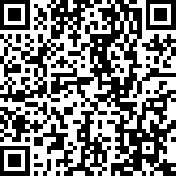

## ZxingManager

zxing管理器


### 二维码

解析

```
Result result = ZXingManager.decodeQRCode( bitmap );
```

生成

```
mBitmap = ZXingManager.createQRCode( text );
```



### 条形码

解析

```
Result result = ZXingManager.decodeOneD( bitmap );
```

生成

```
mBitmap = ZXingManager.createCode128( text, 1000, 300 );
```


### Pdf417

解析

```
Result result = ZXingManager.decodePdf417( bitmap );
```

生成

```
mBitmap = ZXingManager.createPdf417( text, 500, 200 );
```


### DataMatrix

解析

```
Result result = ZXingManager.decodeDataMatrix( bitmap, true );
```

生成

```
mBitmap = ZXingManager.createDataMatrix( text, 500 );
```


### Aztec

解析

```
Result result = ZXingManager.decodeAztec( bitmap );
```

生成

```
mBitmap = ZXingManager.createAztec( text, 500 );
```


